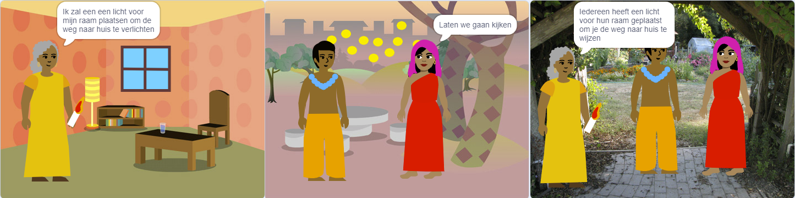

## Bouwen 🧱 en testen 🔄

Nu is het tijd om je boek te maken. Begin klein en voeg meer toe aan je project als je tijd hebt.



**Tip:** Denk eraan om je project elke keer dat je iets toevoegt, te testen. Het is veel gemakkelijker om fouten te vinden en op te lossen voordat je meer wijzigingen aanbrengt.

### Voor elke pagina 📃

--- task ---

Voeg de achtergrond en nieuwe sprites toe die je nodig hebt voor deze pagina.


Je moet code toevoegen om de posities en zichtbaarheid van sprites op de eerste titelpagina en elke pagina daarna in te stellen.

```blocks3
when flag clicked

when backdrop switches to [pagina v]
```

[[[scratch3-show-hide-sprites-backdrops]]]

[[[scratch3-positioning-with-layers]]]

--- /task ---

### Voor elke sprite 🐈 🐢 🎈

--- task ---

Je moet code toevoegen aan elk personage en object-sprite in je boek. Overweeg of ze iets zullen doen wanneer het project start, wanneer de achtergrond overschakelt naar een bepaalde pagina of wanneer op de sprite wordt geklikt.

```blocks3
when flag clicked

when this sprite clicked

when backdrop switches to [pagina v]
```

[[[scratch3-change-costumes-to-show-mood]]]

[[[scratch3-animate-movement-costumes]]]

[[[scratch3-graphic-effects]]]

[[[scratch3-jiggle-a-sprite]]]

--- /task ---

### De pagina omslaan 📖

--- task ---

Je hebt een manier nodig waarop je lezer naar de volgende pagina in je boek kan gaan.

```blocks3
when this sprite clicked
```

[[[scratch3-changing-backdrops-pages-levels]]]

--- /task ---

### Bewerk uiterlijken 🦁 en achtergronden 🖼️

--- task ---

Misschien wil je uiterlijken of achtergronden aanpassen of toevoegen in de teken-editor.

{:width="250px"}


[[[scratch3-paint-a-new-backdrop-extended]]]

[[[scratch3-backdrops-and-sprites-using-shapes]]]

[[[scratch3-use-text-tool]]]

[[[scratch3-copy-parts-between-sprite-costumes]]]

[[[scratch3-add-costumes-to-a-sprite]]]

--- /task ---

### Geluid toevoegen 🎵

--- task ---


```blocks3
when flag clicked

when this sprite clicked

when backdrop switches to [pagina v]
```


[[[scratch3-add-sound]]]


[[[scratch3-record-sound]]]


[[[scratch3-text-to-speech]]]

--- /task ---

### Geheugensteuntjes voor de Scratch editor

[[[scratch3-copy-code]]]

[[[scratch3-full-screen]]]

[[[scratch3-duplicate-sprite]]]

--- task ---

**Test:** 🔄 Laat iemand anders je project zien en vraag om 🗣️ hun feedback. Wil je iets veranderen aan je boek?

⏱️ Als je tijd hebt, kun je jouw project verbeteren.

💡 Je kunt:
- Meer code aan je sprites toevoegen
- Nog een sprite toevoegen
- Nog een pagina toevoegen
- Een geluid opnemen
- Maak een nieuw uiterlijk in de teken-editor

--- /task ---

--- task ---

**Debug:** 🐞 Mogelijk vind je enkele fouten in jouw project die je moet oplossen. Hier zijn enkele veelvoorkomende fouten:

--- collapse ---
---
title: Er wordt een sprite op de verkeerde pagina's weergegeven of verborgen
---

Controleer of de sprite bij `wanneer achtergrond verandert naar`{:class="block3events"} scripts een `verschijn`{:class="block3looks"} of `verdwijn`{:class="block3looks"} blok heeft. Controleer of je de juiste achtergrond naam hebt gekozen in het `wanneer achtergrond verandert naar`{:class="block3events"} blok. Het helpt om achtergronden namen te geven die je gemakkelijk kunt begrijpen, om dit soort problemen op te sporen.

--- /collapse ---

--- collapse ---
---
title: Een sprite staat ondersteboven
---

Voeg een `maak draaistijl links-rechts`{:class="block3motion"} blok toe of `maak draaistijl niet draaien`{:class="block3motion"}.

--- /collapse ---

--- collapse ---
---
title: Een sprite 'springt' wanneer hij van uiterlijk verandert of stuitert
---

Zorg ervoor dat het uiterlijk gecentreerd is in de teken-editor (lijn het blauwe kruis in het uiterlijk op met het dradenkruis in het midden van de teken-editor).

--- /collapse ---

--- collapse ---
---
title: Er wordt geen geluid afgespeeld
---

Heb je een `start geluid`{:class="block3sound"} blok toegevoegd waar dat nodig is? Als je code van een andere sprite hebt gekopieerd, moet je het geluid aan deze sprite toevoegen in het tabblad **Geluiden**. Controleer het volume op je computer of tablet en zorg ervoor dat je het volume niet met code hebt verlaagd — probeer `zet volume op`{:class="block3sound"} `100%`.

--- /collapse ---

--- collapse ---
---
title: Andere sprites worden steeds voor een sprite weergegeven
---

Voeg een `ga naar laag voorgrond`{:class="block3looks"} blok toe.

--- /collapse ---

--- collapse ---
---
title: Een sprite beweegt of verandert maar één keer
---

Zet je code in een `herhaal`{:class="block3control"} blok zodat het blijft bewegen.

--- /collapse ---

--- collapse ---
---
title: De pagina's staan in de verkeerde volgorde
---

Controleer in welke volgorde je achtergronden zich bevinden: klik op het deelvenster Speelveld en vervolgens op **Achtergronden** om de achtergronden voor jouw project te bekijken.

--- /collapse ---

Mogelijk vind je een fout die hier niet wordt vermeld. Kun je erachter komen hoe je het kunt oplossen?

🗣️ We horen graag over je fouten en hoe je ze hebt opgelost. Gebruik de **Feedback verzenden** knop onderaan deze pagina en vertel ons of je een andere fout in je project hebt gevonden.

--- /task ---

