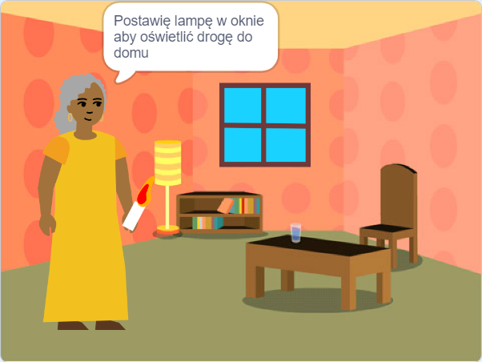

## Co będziesz robić

Zrób 📚 książkę w Scratchu według własnego pomysłu 💡.

Co zrobisz:

+ Stworzysz cyfrową książkę dla konkretnej osoby
+ Wybierzesz umiejętności, których użyjesz do stworzenia swojej książki
+ Udostępnisz adres internetowy swojej książki

--- no-print ---

--- task ---

### Zagraj ▶️ 

Kliknij róg, aby przewrócić stronę.

Szukaj duszków, które pojawiają się i znikają na różnych stronach.
  
Co się stanie, gdy klikniesz na każdego duszka?

  <iframe allowtransparency="true" width="485" height="402" src="" frameborder="0"></iframe>

--- /task ---

--- /no-print ---

Twoja książka będzie musiała spełniać **założenia projektu**.

**Założenia projektu** określają jego cele i zakres działania. To trochę tak, jakby otrzymać misję do wykonania.

### 🎯 ZAŁOŻENIA PROJEKTU: Utwórz **cyfrową książkę**

Musisz zdecydować, jakiego rodzaju książkę chcesz stworzyć i dla kogo jest ona przeznaczona. 

Twoja książka powinna:
+ 📃 Mieć wiele stron z możliwością przejścia na następną stronę
+ 🐢 Mieć co najmniej jednego duszka
+ 💬 Powiedzieć lub zrobić coś innego na każdej stronie

Twoja książka może:
+ 🔉 Przemówić lub posiadać efekty dźwiękowe 
+ 🎨 Mieć tekst lub grafikę utworzoną w edytorze Paint
+ 🖱️ Mieć interaktywne funkcje na każdej stronie

--- no-print ---

### Zdobądź pomysły 💭

--- task ---

Zagraj w te przykładowe projekty, aby znaleźć pomysły na swoją książkę:

⭐ Udostępnij swój ukończony projekt "Zrobiłem ci książkę", aby mieć szansę na opublikowanie go tutaj.

  <iframe allowtransparency="true" width="485" height="402" src="" frameborder="0"></iframe>

  <iframe allowtransparency="true" width="485" height="402" src="" frameborder="0"></iframe>

  <iframe allowtransparency="true" width="485" height="402" src="" frameborder="0"></iframe>

  <iframe allowtransparency="true" width="485" height="402" src="" frameborder="0"></iframe>

--- /task ---

--- /no-print ---

--- print-only ---

### Zdobądź pomysły 💭

Aby znaleźć pomysły na swoją 📚 książkę, **Zajrzyj do środka** przykładowych projektów w studiu Scratch „Zrobiłem Ci książkę — Przykłady”: https://scratch.mit.edu/studios/29082370

--- /print-only ---

