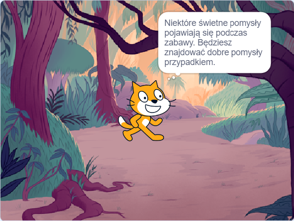

## Zaplanuj swoją książkę 📔

Wykorzystaj ten etap do zaplanowania swojej książki. Wymyśl, co chcesz zrobić, dodając tła i duszki w Scratchu lub rysując albo pisząc — lub jak tylko chcesz!

Teraz nadszedł czas, aby zacząć myśleć o stronach (tłach) oraz postaciach i obiektach (duszkach) w twojej książce.

--- task ---

Otwórz [projekt startowy Zrobiłem Ci książkę](https://scratch.mit.edu/projects/582223042/editor){:target="_blank"}. Scratch otworzy się w nowej karcie przeglądarki.

⏱️ Mało czasu? Możesz zacząć od jednego z [przykładów](https://scratch.mit.edu/studios/29082370){:target="_blank"}.

--- collapse ---
---
title: Praca offline
---

Aby uzyskać informacje o tym, jak skonfigurować Scratcha do użytku w trybie offline, odwiedź [nasz przewodnik „Wprowadzenie do Scratcha”](https://projects.raspberrypi.org/en/projects/getting-started-scratch){:target="_blank"}.

--- /collapse ---

--- /task ---

--- task ---

Użyj swojego nowego projektu Scratch, aby zaplanować swoją książkę. Nie musisz planować wszystkich stron, które możesz dodać później.

Możesz także użyć ✏️ ołówka [tego arkusza planowania](resources/i-made-a-book-worksheet.pdf){:target="_blank"} lub kartki papieru, aby naszkicować swoje pomysły.

Pomyśl o tłach i duszkach:
- 🖼️ Jakie obrazki lub kolory tła użyjesz w swojej książce?
- 🗒️ Co użytkownicy mają zrobić w Twojej książce, aby przejść do następnej strony?
- 🦁 Jakie postacie i przedmioty będziesz mieć w swojej książce?
- 🏃‍♀️ Jak duszki będą animowane i jak się zachowają na każdej stronie?

{:width="300px"}

--- /task ---
