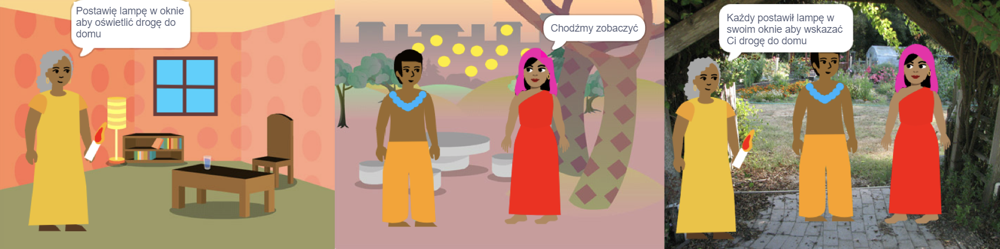

## Buduj i testuj

Nadszedł czas, aby zrobić Twoją książkę. Zacznij od czegoś małego i dodaj więcej do swojego projektu, jeśli masz czas.

**Wskazówka:** Pamiętaj, aby testować swój projekt za każdym razem, gdy coś dodasz. Znacznie łatwiej jest znaleźć i naprawić błędy zanim wprowadzisz więcej zmian.

--- task ---

Musisz zdecydować, w jakiej kolejności budować swoją książkę. Aby rozpocząć, możesz:
- utworzyć wszystkie strony jako tło, lub
- zrobić najpierw jedną działającą stronę

--- /task ---

Z początku możesz nie mieć czasu na dodanie do swojej książki wszystkiego, czego chcesz. To jest w porządku — zawsze możesz wrócić do swojego projektu później. 

--- task ---

Zdobyłeś kilka naprawdę przydatnych umiejętności w Scratchu. Oto przypomnienie, które pomoże Ci zrobić książkę:

Kod:

[[[scratch3-changing-backdrops-pages-levels]]]

[[[scratch3-change-costumes-to-show-mood]]]

[[[scratch3-animate-movement-costumes]]]

[[[scratch3-graphic-effects]]]

[[[scratch3-show-hide-sprites-backdrops]]]

[[[scratch3-positioning-with-layers]]]

[[[scratch3-jiggle-a-sprite]]]

Edytor Malowania— tła i kostiumy:

[[[scratch3-paint-a-new-backdrop-extended]]]

[[[scratch3-backdrops-and-sprites-using-shapes]]]

[[[scratch3-use-text-tool]]]

[[[scratch3-copy-parts-between-sprite-costumes]]]

[[[scratch3-add-costumes-to-a-sprite]]]

Dźwięk:

[[[scratch3-add-sound]]]

[[[scratch3-record-sound]]]

[[[scratch3-text-to-speech]]]

Edytor Scratch:

[[[scratch3-copy-code]]]

[[[scratch3-full-screen]]]

[[[scratch3-duplicate-sprite]]]

--- /task ---

--- task ---

**Test:** Pokaż komuś swój projekt i poproś o opinię. Czy chcesz wprowadzić jakieś zmiany w swojej książce?

--- /task ---

--- task ---

**Debugowanie:** Być może znajdziesz błędy w swoim projekcie, które musisz naprawić. Oto kilka typowych błędów:

--- collapse ---
---
title: Duszek pojawia się lub znika na niewłaściwych stronach
---

Sprawdź, czy duszek ma skrypty `kiedy tło zmieni się na` {:class="block3events"} z blokami `pokaż`{:class="block3looks"} lub `ukryj`{:class="block3looks"}, według potrzeb. Sprawdź, czy wybrałeś poprawną nazwę tła w bloku `kiedy tło zmieni się na`{:class="block3events"}. Pomaga to nadawać tłom nazwy, które są łatwe do zrozumienia, a to pomaga wykryć problemy tego typu.

--- /collapse ---

--- collapse ---
---
title: Duszek porusza się do góry nogami
---

Dodaj blok `ustaw styl obrotu na lewo-prawo`{:class="block3motion"} lub `ustaw stylu obrotu na nie obracaj`{:class="block3motion"}.

--- /collapse ---

--- collapse ---
---
title: Duszek „przeskakuje”, gdy zmienia kostium lub się odbija
---

Upewnij się, że kostium jest wyśrodkowany w edytorze Paint (wyrównaj niebieski krzyż w kostiumie z celownikiem na środku edytora Paint).

--- /collapse ---

--- collapse ---
---
title: Dźwięk nie jest odtwarzany
---

Czy dodałeś blok `zagraj dźwięk`{:class="block3sound"} tam gdzie potrzeba? Jeśli skopiowałeś kod z innego duszka, będziesz musiał dodać dźwięk do tego duszka w zakładce **Dźwięk**. Sprawdź głośność na komputerze lub tablecie i upewnij się, że nie obniżyłeś głośności kodem — spróbuj bloku `ustaw głośność na`{:class="block3sound"} `100`.

--- /collapse ---

--- collapse ---
---
title: Inne duszki nachodzą na duszka
---

Dodaj blok `przesuń na wierzch`{:class="block3motion"}.

--- /collapse ---

--- collapse ---
---
title: Duszek porusza się lub zmienia tylko raz
---

Umieść swój kod wewnątrz bliku `zawsze`{:class="block3control"}, aby nie przestawał działać.

--- /collapse ---

--- collapse ---
---
title: Strony są w złej kolejności
---

Sprawdź, w jakiej kolejności są Twoje tła: kliknij panel Scena, a następnie **Tła**, aby wyświetlić tła dla swojego projektu.

--- /collapse ---

Możesz też znaleźć błąd, który nie jest tutaj wymieniony. Może wymyślisz, jak to naprawić?

Uwielbiamy słuchać o błędach jakie znalazłeś i o tym, jak je naprawiłeś. Użyj przycisku **Prześlij opinię** na dole tej strony i poinformuj nas, czy znalazłeś inny błąd w swoim projekcie.

--- /task ---

--- save ---
