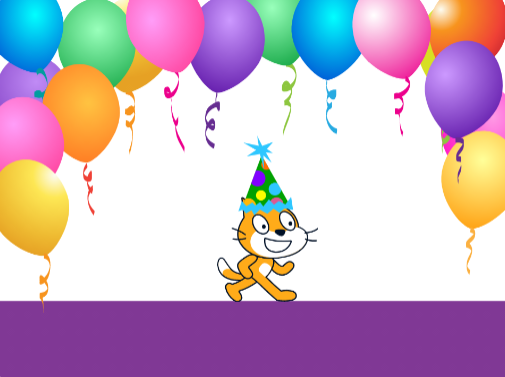

## Przemyślenia

Czy udało Ci się spełnić **założenia projektu**? Pomyśl o swoim projekcie i przejrzyj poniższą listę kontrolną oraz sprawdź funkcje, które posiada Twój projekt.

Twoja książka powinna zawierać:

--- task ---

Wiele stron, z możliwością przejścia do następnej strony

--- /task ---

--- task ---

Co najmniej jeden duszek

--- /task ---

--- task ---

Różne akcje na każdej stronie

--- /task ---

Twoja książka może również zawierać:

--- task ---

Głosy lub efekty dźwiękowe

--- /task ---

--- task ---

Tekst lub grafikę, utworzoną w edytorze Paint

--- /task ---

--- task ---

Interaktywne funkcje na każdej stronie

--- /task ---

Możesz pomyśleć o tym, jak zrobiłeś swoją książkę, aby pomóc sobie w przyszłych projektach:

--- task ---

Jak wpadłeś na swoje pomysły?

--- /task ---

--- task ---

Jakich fajnych nowych rzeczy się nauczyłeś?

--- /task ---

### Teraz jesteś autorem cyfrowej książki!

Poświęć chwilę na świętowanie tego, co zrobiłeś.

--- task ---

Gdzie zabierzesz swoje nowe moce? Co zrobisz dalej?

--- /task ---

