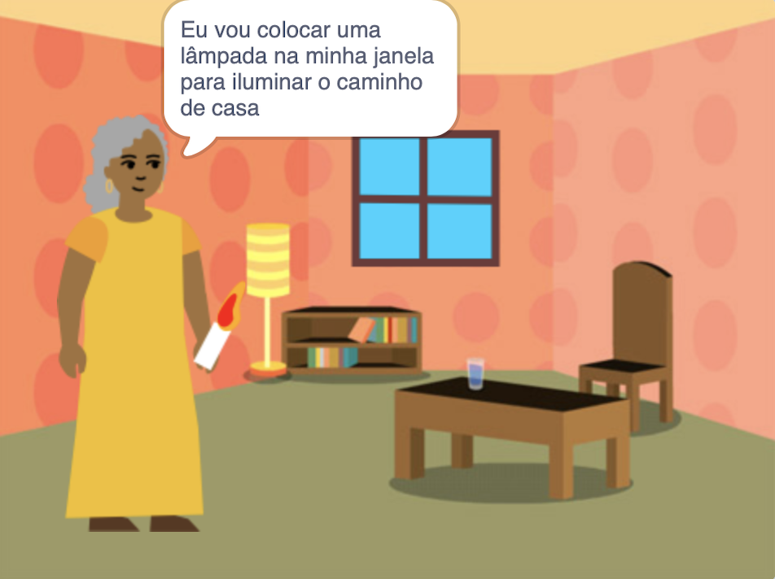

## Introdução

Crie um livro no Scratch baseado em sua própria ideia. O seu livro precisará atender aos critérios do **resumo do projeto**.

O **resumo do projeto** descreve o que um projeto deve fazer. É mais ou menos como receber uma missão para cumprir.

Você deve:

+ Pensar em ideias para criar um livro digital para alguém específico
+ Escolher quais habilidades usar para criar o seu livro
+ Compartilhar um endereço da web para o seu livro

--- no-print ---

--- task ---

### Experimente

Clique no canto para virar a página.

Quantas páginas tem o livro?

Procure por atores que aparecem e se escondem em páginas diferentes.

**Ilumine o caminho para casa**: [Veja o exemplo](https://scratch.mit.edu/projects/628381907/editor){:target="_blank"}

  <iframe allowtransparency="true" width="485" height="402" src="https://scratch.mit.edu/projects/embed/628381907/?autostart=false" frameborder="0"></iframe>

--- /task ---

--- /no-print ---

### RESUMO DO PROJETO: Crie um **livro digital**

O seu livro pode ser um livro de histórias, um livro tutorial, um livro de curiosidades, um livro interativo ou alguma outra coisa.

Você deve escolher para quem escrever o livro, como "minha irmãzinha", "fãs de dinossauros" ou "pessoas que estão aprendendo a cantar".  

Seu livro deve:
+ Ter várias páginas, com uma maneira de ir para a próxima página
+ Ter pelo menos um ator
+ Dizer ou fazer algo diferente em cada página

Seu livro poderia:
+ Ter fala ou efeitos sonoros
+ Ter texto ou arte criada no editor Pintar
+ Ter recursos interativos em todas as páginas

Um **livro digital** (ou e-book) é um livro criado e lido em um computador, tablet, telefone ou outro dispositivo eletrônico. Você já leu algum livro em um dispositivo digital?

--- no-print ---

### Inspire-se

--- task ---

Explore estes projetos de exemplo para obter ideia para o seu livro:

**Monstro das cócegas**: [Veja o example](https://scratch.mit.edu/projects/628385289/editor){:target="_blank"}

  <iframe allowtransparency="true" width="485" height="402" src="https://scratch.mit.edu/projects/embed/628385289/?autostart=false" frameborder="0"></iframe>

**O Gato Scratch que se camufla**: [Veja o exemplo](https://scratch.mit.edu/projects/628383017/editor){:target="_blank"}

  <iframe allowtransparency="true" width="485" height="402" src="https://scratch.mit.edu/projects/embed/628383017/?autostart=false" frameborder="0"></iframe>

**Investigando o código**: [Veja o interior](https://scratch.mit.edu/projects/623753107/editor){:target="_blank"}
Clique no personagem e no objeto para escolher os quais deseja na história e, em seguida, clique no Palco para virar a página.

  <iframe allowtransparency="true" width="485" height="402" src="https://scratch.mit.edu/projects/embed/623753107/?autostart=false" frameborder="0"></iframe>

--- /task ---

--- /no-print ---

--- print-only ---

### Inspire-se

Para obter ideias para o seu livro, **Veja exemplos** de projetos no estúdio Scratch 'Eu fiz um livro para você - Exemplos': https://scratch.mit.edu/studios/29082370

--- /print-only ---

