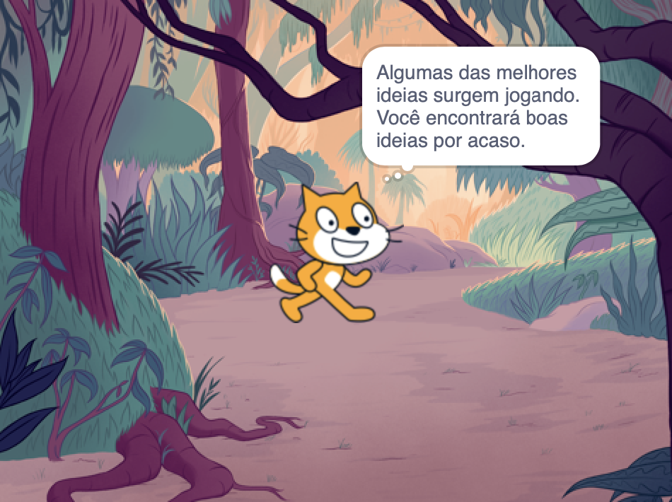

## A sua idéia

Use esta etapa para planejar seu livro. Você pode planejar apenas pensando, adicionando cenários e atores no Scratch, ou desenhando ou escrevendo - ou como quiser!

### Por que você está fazendo o livro?

--- task ---

Pense no propósito do seu livro.

Pode ser:
- Para entreter uma criança mais nova
- Para compartilhar uma mensagem importante, como incentivar a reciclagem
- Para ensinar alguém a fazer algo, como fazer sua comida favorita
- Para contar ou recontar uma história
- Para compartilhar algo sobre você
- Para se expressar e ser criativo

--- /task ---

### Para quem é o livro?

--- task ---

Pense sobre para quem você fará seu livro (seu **público**).

Pode ser para um amigo, para um membro da família, para uma aula na escola, para pessoas que compartilham um hobby, para fãs de um músico ou apenas para você.

--- /task ---

### Iniciar

Agora é hora de começar a pensar nas páginas (cenários) e nos personagens e objetos (atores) do seu livro.

--- task ---

Open the [I made you a book starter project](https://scratch.mit.edu/projects/582223042/editor){:target="_blank"}. O Scratch será aberto em outra aba do navegador.

--- collapse ---
---
title: Trabalhando offline
---

Para obter informações sobre como configurar o Scratch para uso offline, visite [nosso guia 'Primeiros passos com o Scratch'](https://projects.raspberrypi.org/en/projects/getting-started-scratch){:target="_blank"}.

--- /collapse ---

Use seu novo projeto Scratch, uma caneta e papel ou ambos para planejar ideias para seu livro.

--- /task ---

--- task ---

Pense nos cenários e atores:
- Quais cenários ou cores de fundo você usará em seu livro?
- Como os usuários irão interagir com seu livro para ir para a próxima página?
- Quais personagens e objetos você terá em seu livro?
- Como os atores serão animados e irão interagir em cada página?

--- /task ---

--- save ---
