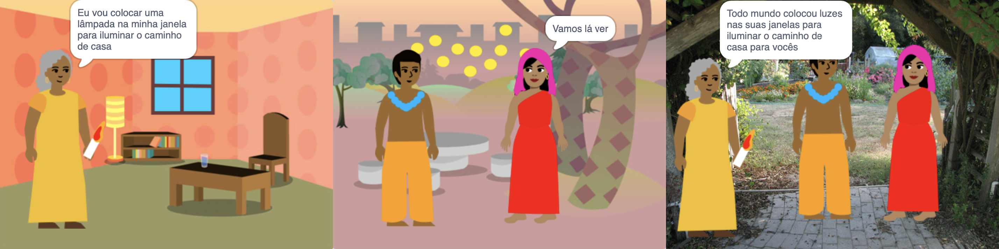

## Construir e testar

Agora é hora de fazer seu livro. Comece pequeno e acrescente mais ao seu projeto se tiver tempo.

**Dica:** Lembre-se de testar seu projeto sempre que adicionar algo. É muito mais fácil localizar e corrigir bugs antes de fazer mais alterações.

--- task ---

Você precisará decidir em que ordem construir seu livro. Para começar, você pode:
- Crie todas as páginas como cenários, ou
- Faça uma página funcionar primeiro

--- /task ---

Você pode não ter tempo suficiente para adicionar tudo o que deseja ao seu livro no início. Tudo bem - você sempre pode voltar ao seu projeto mais tarde. 

--- task ---

Você desenvolveu algumas habilidades realmente úteis no Scratch. Aqui está um lembrete para ajudá-lo a fazer seu livro:

Código:

[[[scratch3-changing-backdrops-pages-levels]]]

[[[scratch3-change-costumes-to-show-mood]]]

[[[scratch3-animate-movement-costumes]]]

[[[scratch3-graphic-effects]]]

[[[scratch3-show-hide-sprites-backdrops]]]

[[[scratch3-positioning-with-layers]]]

[[[scratch3-jiggle-a-sprite]]]

O editor Pintar - cenários e fantasias:

[[[scratch3-paint-a-new-backdrop-extended]]]

[[[scratch3-backdrops-and-sprites-using-shapes]]]

[[[scratch3-use-text-tool]]]

[[[scratch3-copy-parts-between-sprite-costumes]]]

[[[scratch3-add-costumes-to-a-sprite]]]

Som:

[[[scratch3-add-sound]]]

[[[scratch3-record-sound]]]

[[[scratch3-text-to-speech]]]

O editor Scratch:

[[[scratch3-copy-code]]]

[[[scratch3-full-screen]]]

[[[scratch3-duplicate-sprite]]]

--- /task ---

--- task ---

**Teste:** Mostre seu projeto a outra pessoa e peça sua opinião. Deseja fazer alguma alteração em seu livro?

--- /task ---

--- task ---

**Depurar:** Você pode encontrar alguns bugs em seu projeto que precisa corrigir. Aqui estão alguns bugs comuns:

--- collapse ---
---
title: Um ator está sendo exibido ou escondido nas páginas erradas
---

Verifique se o ator tem um script `quando o cenário mudar para`{:class="block3events"} com os blocos `show`{:class="block3looks"} ou `hide`{:class="block3looks"} conforme necessário. Verifique se você escolheu o nome correto do cenário no bloco `quando o cenário mudar para`{ class="block3events"}. Uma dica é dar nomes aos cenários que você possa entender facilmente, para ajudar a detectar problemas como esse.

--- /collapse ---

--- collapse ---
---
title: O ator está de cabeça para baixo
---

Adicione um bloco `defina o estilo de rotação para esquerda-direita`{:class="block3motion"} ou `defina o estilo de rotação para não rotacionar`{:class="block3motion"}.

--- /collapse ---

--- collapse ---
---
title: O ator 'pula' quando muda de fantasia ou salta
---

Certifique-se de que a fantasia esteja centralizada no editor Pintar (alinhe a cruz azul na fantasia com a cruz no centro do editor Pintar).

--- /collapse ---

--- collapse ---
---
title: O som não é reproduzido
---

Você adicionou um bloco `toque o som`{:class="block3sound"} quando necessário? Se você copiou o código de outro ator, você precisará adicionar o som a este ator na aba **Sons**. Verifique o volume do seu computador ou tablet e certifique-se de que não baixou o volume com código - tente `mude o volume para`{:class="block3sound"} `100`.

--- /collapse ---

--- collapse ---
---
title: Outros atores continuam entrando na frente de um ator
---

Adicione um bloco `vá para a camada da frente`{:class="block3looks"}.

--- /collapse ---

--- collapse ---
---
title: O ator só se move ou muda uma vez
---

Coloque seu código dentro de um bloco `sempre`{:class="block3control"} para que ele continue em execução.

--- /collapse ---

--- collapse ---
---
title: As páginas estão na ordem errada
---

Verifique a ordem dos cenários: clique no painel Palco e, em seguida, na aba **Cenários** para ver os cenários do seu projeto.

--- /collapse ---

Você pode encontrar um bug que não está listado aqui. Você consegue descobrir como consertá-lo?

Adoraríamos saber sobre seus bugs e como você os corrigiu. Use o botão **Enviar comentários** na parte inferior desta página e nos diga se você encontrou um bug diferente em seu projeto.

--- /task ---

--- save ---
