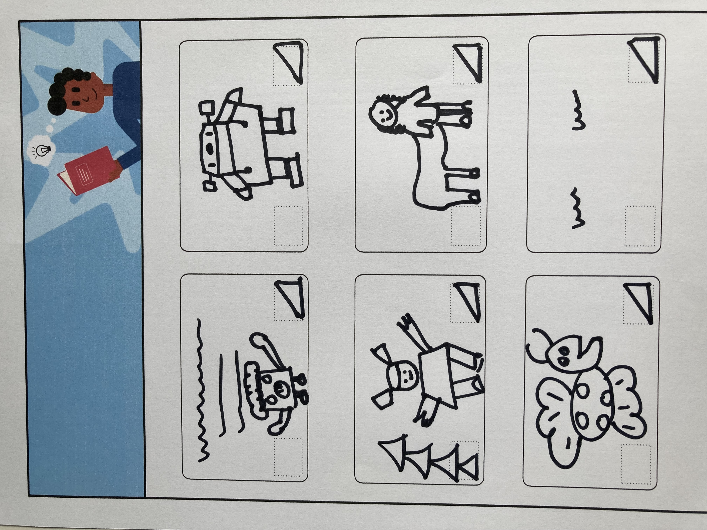

## Planeje seu livro 📔

Use esta etapa para planejar seu livro. Você pode planejar apenas pensando, adicionando cenários e atores no Scratch, ou desenhando, escrevendo ou como quiser!

Agora é hora de começar a pensar nas páginas (cenários) e nos personagens e objetos (atores) do seu livro.

--- task ---

Abra o [Projeto inicial 'Eu fiz um livro para você'](https://scratch.mit.edu/projects/582223042/editor){:target="_blank"}. O Scratch será aberto em outra guia do navegador.

⏱️ Sem muito tempo? Você pode começar com um dos [exemplos](https://scratch.mit.edu/studios/29082370){:target="_blank"}.

--- collapse ---
---
título: Trabalhando off-line
---

Para obter informações sobre como configurar o Scratch para uso off-line, visite nosso guia ['Introdução ao Scratch'](https://projects.raspberrypi.org/en/projects/getting-started-scratch){:target="_blank"}.

--- /collapse ---

--- /task ---

--- task ---

Use seu novo projeto Scratch para planejar seu livro. Você não precisa planejar todas as páginas, você pode adicionar mais posteriormente.

Você também pode usar ✏️ um lápis e a [folha de planejamento](resources/i-made-a-book-worksheet.pdf){:target="_blank"} ou um pedaço de papel para esboçar suas ideias.

Pense nos cenários e atores:
- 🖼️ Quais cenários ou cores de fundo você usará em seu livro?
- 🗒️ Como os usuários vão interagir com seu livro para ir para a próxima página?
- 🦁 Quais personagens e objetos você terá no seu livro?
- Como os atores serão animados e vão interagir em cada página?

{:width="300px"}

--- /task ---
