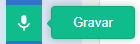

## Construa 🧱 e teste 🔄

Agora é hora de construir seu livro. Comece pequeno e adicione mais ao seu projeto se tiver tempo.


**Dica:** Lembre-se de testar seu projeto cada vez que adicionar algo. É muito mais fácil localizar e corrigir bugs antes de fazer mais alterações.

### Para cada página 📃

--- task ---

Adicione o plano de fundo e os novos atores necessários para esta página.


Você precisará adicionar código para definir as posições e a visibilidade dos atores na primeira página de título e em cada página seguinte.

```blocks3
when flag clicked

when backdrop switches to [page v]
```

[[[scratch3-show-hide-sprites-backdrops]]]

[[[scratch3-positioning-with-layers]]]

--- /task ---

### Para cada ator 🐈 🐢 🎈

--- task ---

Você precisará adicionar código a cada personagem e objeto em seu livro. Considere se eles farão alguma coisa quando o projeto começar, quando o cenário mudar para uma página específica ou quando o ator for clicado.

```blocks3
when flag clicked

when this sprite clicked

when backdrop switches to [page v]
```

[[[scratch3-change-costumes-to-show-mood]]]

[[[scratch3-animate-movement-costumes]]]

[[[scratch3-graphic-effects]]]

[[[scratch3-jiggle-a-sprite]]]

--- /task ---

### Virando a página 📖

--- task ---

Você precisará de uma maneira para o leitor passar para a próxima página do livro.

```blocks3
when this sprite clicked
```

[[[scratch3-changing-backdrops-pages-levels]]]

--- /task ---

### Edite fantasias 🦁 e cenários 🖼️

--- task ---

Você pode editar ou adicionar fantasias e cenários no editor Paint.

{:width="250px"}


[[[scratch3-paint-a-new-backdrop-extended]]]

[[[scratch3-backdrops-and-sprites-using-shapes]]]

[[[scratch3-use-text-tool]]]

[[[scratch3-copy-parts-between-sprite-costumes]]]

[[[scratch3-add-costumes-to-a-sprite]]]

--- /task ---

### Adicionar som 🎵

--- task ---


```blocks3
when flag clicked

when this sprite clicked

when backdrop switches to [page v]
```


[[[scratch3-add-sound]]]



[[[scratch3-record-sound]]]


[[[scratch3-text-to-speech]]]

--- /task ---

### Lembretes do editor Scratch

[[[scratch3-copy-code]]]

[[[scratch3-full-screen]]]

[[[scratch3-duplicate-sprite]]]

--- task ---

**Teste:** 🔄 Mostre seu projeto a outra pessoa e peça 🗣️ sua opinião. Deseja fazer alguma alteração em seu livro?

⏱️ Se você tiver tempo, você pode melhorar o seu projeto.

💡 Você poderia:
- Adicionar mais código aos seus atores
- Adicionar outro ator
- Adicionar outra página
- Gravar um som
- Criar uma nova fantasia no editor Pintar

--- /task ---

--- task ---

**Depuração:** 🐞 Você pode encontrar alguns erros em seu projeto que precisa corrigir. Aqui estão alguns erros comuns:

--- collapse ---
---
title: Um ator está aparecendo ou se escondendo nas páginas erradas
---

Verifique se o ator tem os scripts `quando o cenário mudar para`{:class="block3events"} com os blocos `mostrar`{:class="block3looks"} ou `esconder`{:class="block3looks"} conforme necessário. Verifique se você escolheu o nome correto do cenário no bloco `quando o cenário mudar para`{:class="block3events"}. Uma dica é dar nomes aos cenários que você possa entender facilmente, para ajudar a detectar problemas como esse.

--- /collapse ---

--- collapse ---
---
title: A sprite is going upside down
---

Adicione um bloco `defina o estilo de rotação para esquerda-direita`{:class="block3motion"} ou `defina o estilo de rotação para não rotacionar`{:class="block3motion"}.

--- /collapse ---

--- collapse ---
---
title: Um ator 'pula' quando muda de fantasia ou salta
---

Certifique-se de que a fantasia esteja centralizada no editor Paint (alinhe a cruz azul na fantasia com a cruz no centro do editor Paint).

--- /collapse ---

--- collapse ---
---
title: Um som não toca
---

Você adicionou um bloco `toque o som`{:class="block3sound"} quando necessário? Se você copiou o código de outro ator, você precisará adicionar o som a este ator na guia **Sons**. Verifique o volume do seu computador ou tablet e certifique-se de não ter baixado o volume com o bloco de código - tente `mude o volume para`{:class="block3sound"}` 100`.

--- /collapse ---

--- collapse ---
---
title: Other sprites keep going in front of a sprite
---

Adicione um bloco `vá para a camada da frente`{:class="block3looks"}.

--- /collapse ---

--- collapse ---
---
title: Um ator só se move ou muda uma vez
---

Coloque seu código dentro de um bloco `sempre`{:class="block3control"} para que ele continue executando.

--- /collapse ---

--- collapse ---
---
title: As páginas estão na ordem errada
---

Verifique a ordem que seus cenários estão: clique no painel Palco e depois na guia **Cenários** para visualizar os cenários do seu projeto.

--- /collapse ---

Você pode encontrar um erro que não esteja listado aqui. Você consegue descobrir como consertar?

🗣️ Adoramos ouvir sobre seus erros e como você os corrigiu. Use o botão **Enviar comentários** na parte inferior desta página e diga-nos se você encontrou um erro diferente em seu projeto.

--- /task ---

