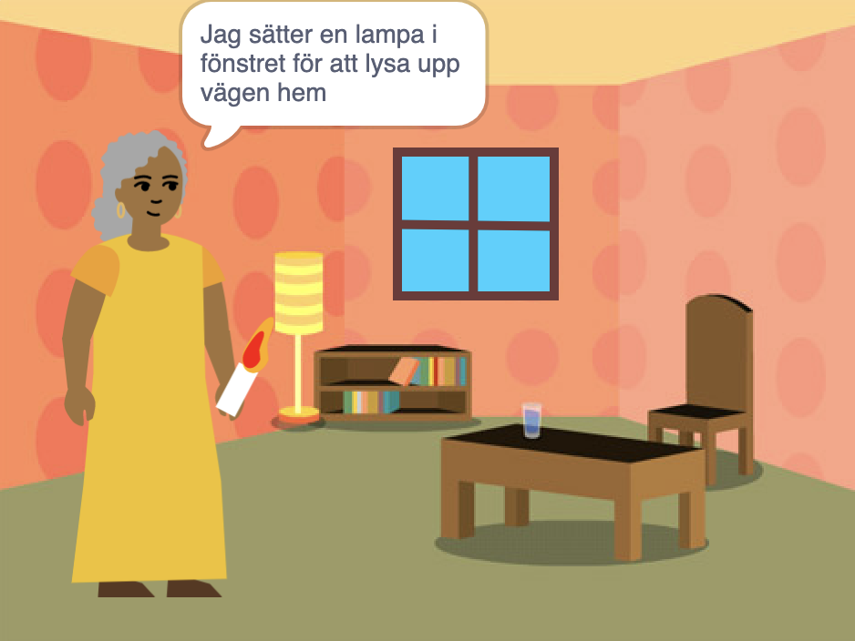

## Du kommer att skapa

Skapa en📚 bok i Scratch utifrån din egen idé 💡.

Du kommer:

+ Skapa en digital bok för någon specifik
+ Välj vilka kunskaper du vill använda för att göra din bok
+ Dela en webbadress till din bok

--- no-print ---

--- task ---

### Spela ▶️ 

Klicka på hörnet för att vända sidan.

Leta efter sprajter som visas och döljs på olika sidor.
  
Vad händer när du klickar på varje sprajt?

  
**Kittelmonster**: [Se inuti](https://scratch.mit.edu/projects/827412358/editor){:target="_blank"}

  <iframe allowtransparency="true" width="485" height="402" src="https://scratch.mit.edu/projects/embed/827412358/?autostart=false" frameborder="0"></iframe>

--- /task ---

--- /no-print ---

Din bok kommer att behöva uppfylla **projektbeskrivningen**.

En **projektbeskrivning** beskriver vad ett projekt går ut på. Det är lite som att få ett uppdrag att genomföra.

### 🎯 PROJEKTBESKRIVNING: Skapa en **digital bok**

Du måste bestämma vilken sorts bok du vill skapa och vem den är till för. 

Din bok ska:
+ 📃 Ha flera sidor, med ett sätt att gå till nästa sida
+ 🐢 Ha minst en sprajt
+ 💬 Säga eller göra något annorlunda på varje sida

Din bok kan:
+ 🔉 Ha tal eller ljudeffekter 
+🎨 Ha text eller konst som har skapats i målarredigeraren
+🖱️ Ha interaktiva funktioner på varje sida

--- no-print ---

### Få idéer 💭

--- task ---

Kolla på dessa exempelprojekt för att få inspiration till din bok:

⭐ Dela ditt färdiga "Jag har gjort en bok till dig"-projekt för en chans att få det visat här.

**Mitt band** 🎸 : [Se inuti](https://scratch.mit.edu/projects/724148783/editor){:target="_blank"}

  <iframe allowtransparency="true" width="485" height="402" src="https://scratch.mit.edu/projects/embed/724148783/?autostart=false" frameborder="0"></iframe>

**⭐ Askungen och spindeln** 🕷️ : [Se inuti](https://scratch.mit.edu/projects/799448516/editor){:target="_blank"}

  <iframe allowtransparency="true" width="485" height="402" src="https://scratch.mit.edu/projects/embed/799448516/?autostart=false" frameborder="0"></iframe>

**⭐ Misslyckad teleportering** 🚀 : [Se inuti](https://scratch.mit.edu/projects/793833913/editor){:target="_blank"} (utvalt community-projekt)

  <iframe allowtransparency="true" width="485" height="402" src="https://scratch.mit.edu/projects/embed/793833913/?autostart=false" frameborder="0"></iframe>

**⭐ Hur vintern kom** ☃️ : [Se inuti](https://scratch.mit.edu/projects/707648744/editor){:target="_blank"} (utvalt samhällsprojekt)

  <iframe allowtransparency="true" width="485" height="402" src="https://scratch.mit.edu/projects/embed/707648744/?autostart=false" frameborder="0"></iframe>

--- /task ---

--- /no-print ---

--- print-only ---

### Få idéer 💭

För att få idéer till din 📚-bok, **Se inuti** exempelprojekt i 'Jag har gjort en bok till dig — Exempel'-scratchstudion: https://scratch.mit.edu/studios/29082370

--- /print-only ---

