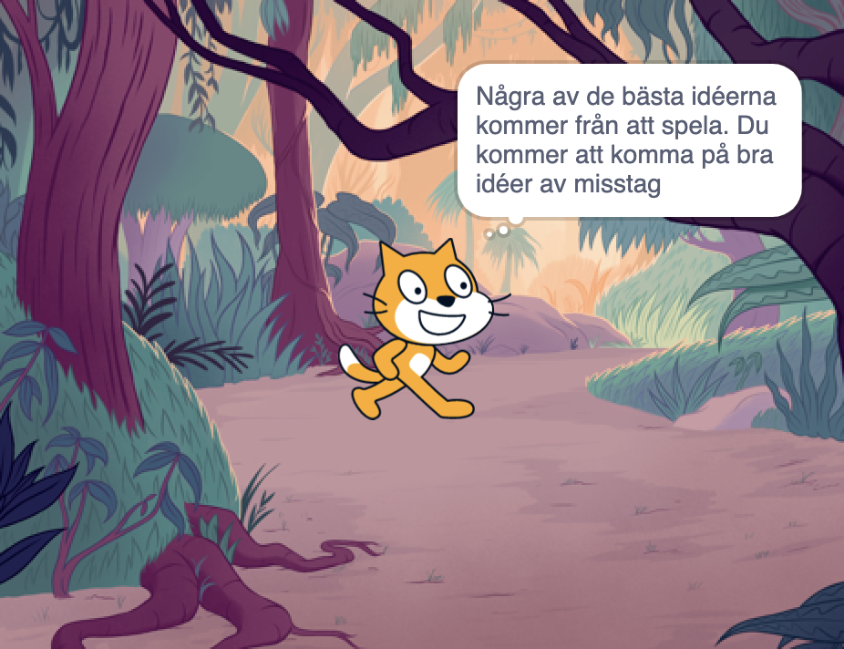

## Planera din bok 📔

Använd det här steget för att planera din bok. Du kan planera genom att bara tänka, lägga till bakgrunder och sprajter i Scratch, rita eller skriva - precis hur du vill!

Nu är det dags att börja tänka på sidorna (bakgrunderna) och karaktärerna och objekten (sprajterna) i din bok.

--- task ---

Öppna [Startprojektet "Jag har gjort en bok till dig"](https://scratch.mit.edu/projects/582223042/editor){:target="_blank"}. Scratch kommer att öppnas i en annan flik i webbläsaren.

⏱️ Inte mycket tid? Du kan utgå från ett av [exemplen](https://scratch.mit.edu/studios/29082370){:target="_blank"}.

--- collapse ---
---
title: Jobbar offline
---

För information om hur du ställer in Scratch för offlineanvändning, besök vår ["Komma igång med Scratch"-guide](https://projects.raspberrypi.org/en/projects/getting-started-scratch){:target="_blank"}.

--- /collapse ---

--- /task ---

--- task ---

Använd ditt nya Scratch-projekt för att planera din bok. Du behöver inte planera alla sidor, du kan lägga till fler senare.

Du kan även använda ✏️ en penna och [detta planeringsblad](resources/i-made-a-book-worksheet.pdf){:target="_blank"} eller ett papper för att skissa på dina idéer.

Tänk på bakgrunderna och sprajterna:
- 🖼️ Vilka bakgrunder eller bakgrundsfärger kommer du att använda i din bok?
- 🗒️ Hur kommer användare att vända blad?
- 🦁 Vilka karaktärer och föremål kommer du att ha i din bok?
- 🏃‍♀️ Hur kommer sprajterna att animeras och bete sig på varje sida?

{:width="300px"}

--- /task ---
