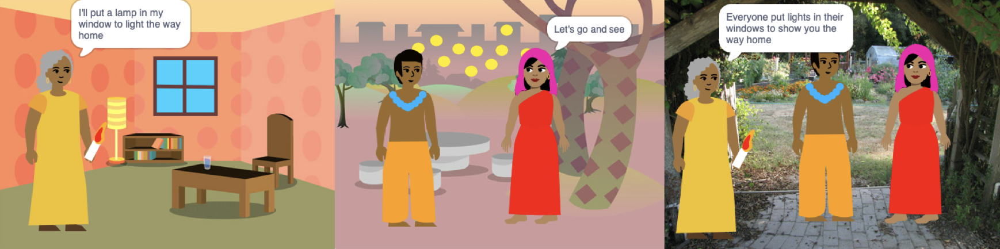
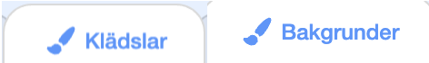
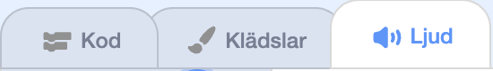

## Bygg 🧱 och testa 🔄

Nu är det dags att skapa din bok. Börja litet och lägg till mer till ditt projekt om du har tid.



**Tips:** Kom ihåg att testa ditt projekt varje gång du lägger till något. Det är mycket lättare att hitta och fixa fel innan du gör fler ändringar.

### För varje sida 📃

--- task ---

Lägg till bakgrunden och de nya sprajter du behöver för den här sidan.


Du måste lägga till kod för att ställa in sprajternas positioner och synlighet på första titelsidan och varje sida efter det.

```blocks3
when flag clicked

when backdrop switches to [page v]
```

[[[scratch3-show-hide-sprites-backdrops]]]

[[[scratch3-positioning-with-layers]]]

--- /task ---

### För varje sprajt 🐈 🐢 🎈

--- task ---

Du måste lägga till kod till varje karaktär och objektsprajt i din bok. Fundera på om de kommer att göra något när projektet startar, när bakgrunden växlar till en viss sida eller när sprajten klickas på.

```blocks3
when flag clicked

when this sprite clicked

when backdrop switches to [page v]
```

[[[scratch3-change-costumes-to-show-mood]]]

[[[scratch3-animate-movement-costumes]]]

[[[scratch3-graphic-effects]]]

[[[scratch3-jiggle-a-sprite]]]

--- /task ---

### Vänder blad 📖

--- task ---

Du behöver ett sätt för din läsare att byta blad i din bok.

```blocks3
when this sprite clicked
```

[[[scratch3-changing-backdrops-pages-levels]]]

--- /task ---

### Redigera klädslar 🦁 och bakgrunder 🖼️

--- task ---

Du kanske vill redigera eller lägga till klädslar eller bakgrunder i målarredigeraren.

{:width="250px"}


[[[scratch3-paint-a-new-backdrop-extended]]]

[[[scratch3-backdrops-and-sprites-using-shapes]]]

[[[scratch3-use-text-tool]]]

[[[scratch3-copy-parts-between-sprite-costumes]]]

[[[scratch3-add-costumes-to-a-sprite]]]

--- /task ---

### Lägg till ljud 🎵

--- task ---



```blocks3
when flag clicked

when this sprite clicked

when backdrop switches to [page v]
```


[[[scratch3-add-sound]]]


[[[scratch3-record-sound]]]


[[[scratch3-text-to-speech]]]

--- /task ---

### Påminnelser i Scratchredigeraren

[[[scratch3-copy-code]]]

[[[scratch3-full-screen]]]

[[[scratch3-duplicate-sprite]]]

--- task ---

**Test:** 🔄 Visa någon annan ditt projekt och be om 🗣️ deras feedback. Vill du ändra något i din bok?

⏱️ Om du har tid kan du uppgradera ditt projekt.

💡 Du skulle kunna:
- Lägga till mer kod till dina sprajter
- Lägga till en sprajt
- Lägga till en sida till
- Spela in ett ljud
- Skapa en ny klädsel i målarredigeraren

--- /task ---

--- task ---

**Debug:** 🐞 Du kanske hittar några fel i ditt projekt som du behöver fixa. Här är några vanliga fel:

--- collapse ---
---
title: En sprite visas eller döljs på fel sidor
---

Kontrollera att sprajten har `när bakgrunden byter till`{:class="block3events"}-kod med `visa`{:class="block3looks"}- eller `dölj`{:class="block3looks"}-block enligt behov. Kontrollera att du har valt rätt bakgrundsnamn i `när bakgrunden byter till`{:class="block3events"}-blocket. Det underlättar att ge bakgrundsnamn som du lätt kan förstå för att hjälpa till att upptäcka problem som detta.

--- /collapse ---

--- collapse ---
---
titel: En sprajt går upp och ner
---

Lägg till ett `"sätt rotationsstil vänster-höger"`{:class="block3motion"}-block eller ett `"sätt rotationsstil, rotera inte"`{:class="block3motion"}-block.

--- /collapse ---

--- collapse ---
---
titel: En sprajt "hoppar" när den byter klädsel eller studsar
---

Se till att klädseln är centrerad i målarredigeraren (placera det blåa korset i klädseln över krysset i mitten av målarredigeraren).

--- /collapse ---

--- collapse ---
---
title: Ett ljud spelas inte upp
---

Har du lagt till ett block som `spelar ljud`{:class="block3sound"} när det behövs? Om du har kopierat kod från en annan sprajt måste du lägga till ljudet till denna sprajt i **Ljud**fliken. Kontrollera volymen på din dator eller surfplatta och se till att du inte har sänkt volymen med kod — prova `sätt volymen till`{:class="block3sound"} `100`.

--- /collapse ---

--- collapse ---
---
title: Andra sprajter går framför en sprajt hela tiden
---

Lägg till ett `"gå till översta lagret"`{:class="block3looks"}-block.

--- /collapse ---

--- collapse ---
---
title: En sprajt rör sig eller ändras bara en gång
---

Lägg din kod i ett `för alltid`{:class="block3control"}-block så att den fortsätter att köras.

--- /collapse ---

--- collapse ---
---
title: Sidorna är i fel ordning
---

Kontrollera i vilken ordning dina bakgrunder är: klicka på scenpanelen och sedan på fliken **Bakgrunder** för att se bakgrunderna i ditt projekt.

--- /collapse ---

Du kanske hittar ett fel som inte finns med här. Kan du komma på hur man fixar det?

🗣️ Vi hör gärna om dina buggar och hur du har fixat dem. Använd **"Skicka feedback"**-knappen längst ner på denna sida och berätta för oss om du hittade ett annat fel i ditt projekt.

--- /task ---

