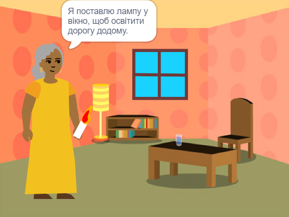

## Ти зробиш

Створиш 📚книгу в Scratch на основі своєї власної ідеї 💡.

Зможеш:

+ Створити цифрову книгу для когось конкретного
+ Обрати які навички використовувати для створення своєї книги
+ Поділитись посиланням на свою книгу

--- no-print ---

--- task ---

### Грати ▶️ 

Клацни по кутку, щоб перегорнути сторінку.

Шукай спрайти, які показуються і ховаються на різних сторінках.
  
Що відбувається, якщо натиснути на кожен спрайт?

  
**Лоскотливий монстр**: [Переглянути код](https://scratch.mit.edu/projects/757489418/editor){:target="_blank"}

  <iframe allowtransparency="true" width="485" height="402" src="https://scratch.mit.edu/projects/embed/500189097/?autostart=false" frameborder="0"></iframe>

--- /task ---

--- /no-print ---

Ваша книга повинна відповідати вимогам **короткого опису проєкту**.

**короткий опис проєкту** описує, що повинен зробити проєкт. Це схоже на отримання завдання, яке необхідно виконати.

### 🎯 КОРОТКИЙ ОПИС проєкту: Створи **електронну книгу**

Тобі потрібно буде вирішити, який тип книги ти хочеш створити і для кого вона буде призначена. 

Твоя книга повинна:
+ 📃 Мати кілька сторінок, з можливістю переходу на наступну сторінку
+ 🐢 Мати хоча б одного спрайта
+ 💬 Говорити або виконувати щось інше на кожній сторінці

Твоя книга може:
+ 🔉 Мати голосові або звукові ефекти 
+ 🎨 Мати текст або малюнки, які були створені в редакторі Малювання 
+ 🖱️ Мати інтерактивні функції на кожній сторінці

--- no-print ---

### Отримай ідеї 💭

--- task ---

Спробуй ці приклади проєктів, щоб отримати ідеї для своєї книги:

⭐ Поділися своїм готовим проєктом Сюрприз, щоб мати шанс бути опублікованим у цьому списку.

**Мій гурт** 🎸 : [Переглянути код](https://scratch.mit.edu/projects/757491049/editor){:target="_blank"}

  <iframe allowtransparency="true" width="485" height="402" src="https://scratch.mit.edu/projects/embed/724148783/?autostart=false" frameborder="0"></iframe>

**Освітли дорогу додому** 🕯️ : [Переглянути код](https://scratch.mit.edu/projects/757493452/editor){:target="_blank"}

  <iframe allowtransparency="true" width="485" height="402" src="https://scratch.mit.edu/projects/embed/799448516/?autostart=false" frameborder="0"></iframe>

**⭐ Як прийшла зима** ☃️ : [Переглянути код](https://scratch.mit.edu/projects/707648744/editor){:target="_blank"} (проєкт спільноти)

  <iframe allowtransparency="true" width="485" height="402" src="https://scratch.mit.edu/projects/embed/793833913/?autostart=false" frameborder="0"></iframe>

**⭐ How winter came** ☃️ : [See inside](https://scratch.mit.edu/projects/707648744/editor){:target="_blank"} (featured community project)

  <iframe allowtransparency="true" width="485" height="402" src="https://scratch.mit.edu/projects/embed/707648744/?autostart=false" frameborder="0"></iframe>

--- /task ---

--- /no-print ---

--- print-only ---

### Отримай ідеї 💭

To get ideas for your 📚 book, **See inside** example projects in the 'I made you a book — Examples' Scratch studio: https://scratch.mit.edu/studios/29082370

--- /print-only ---

