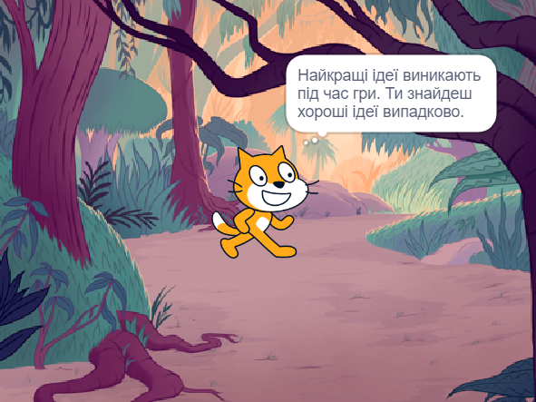

## Сплануй свою книгу 📔

Використовуй цей пункт, щоб спланувати свою книгу. Ти можеш спланувати, коли просто думаєш, додаєш фони та спрайти у Scratch, малюєш чи пишеш - або як тобі більше подобається!

Настав час подумати про сторінки (тла), персонажі та об'єкти (спрайти) для твоєї книги.

--- task ---

Відкрий [Стартовий проєкт Я зробив тобі книжку](https://scratch.mit.edu/projects/582223042/editor){:target="_blank"}. Scratch відкриється в іншій вкладці браузера.

⏱️ Недостатньо часу? Ти можеш почати з одного з [прикладів](https://scratch.mit.edu/studios/29082370){:target="_blank"}.

--- collapse ---
---
title: Робота в режимі офлайн
---

Інформацію про те, як налаштувати Scratch для роботи в режимі офлайн, можна знайти у [нашому керівництві Початок роботи в Scratch'](https://projects.raspberrypi.org/en/projects/getting-started-scratch){:target="_blank"}.

--- /collapse ---

--- /task ---

--- task ---

Використовуй свій новий проєкт Scratch, щоб спланувати свою книгу. Тобі не обов'язково планувати всі сторінки, ти можеш додати їх пізніше.

Ти також можеш скористатися ✏️ олівцем та [цим листом планування](resources/i-made-a-book-worksheet.pdf){:target="_blank"} або аркушем паперу, щоб замалювати свої ідеї.

Подумай про тло та спрайти:
- Які тла або фонові кольори ти будеш використовувати у своїй книзі?
- 🗒️ Як користувачі будуть взаємодіяти з твоєю книгою, щоб перейти на наступну сторінку?
- 🦁 Які персонажі та предмети будуть у твоїй книзі?
- 🏃‍♀️ Як спрайти будуть анімовані та взаємодіяти на кожній сторінці?

{:width="300px"}

--- /task ---
