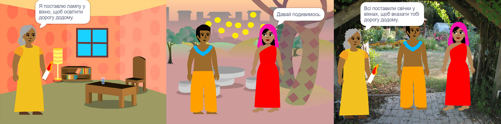

## Побудуй 🧱 та протестуй 🔄

Настав час побудувати свою книгу. Почни з малого, а потім, якщо буде час, додай до свого проєкту більше.



**Порада:** Не забувай тестувати свій проєкт кожного разу, коли щось додаєш. Набагато простіше знайти та виправити помилки до того, як внести нові зміни.

### Для кожної сторінки 📃

--- task ---

Додай тло та нові спрайти, які тобі потрібні для цієї сторінки.


Тобі потрібно буде додати код, щоб задати позиції та видимість спрайтів на першій титульній сторінці та на кожній наступній сторінці.

```blocks3
when flag clicked

when backdrop switches to [сторінка v]
```

[[[scratch3-show-hide-sprites-backdrops]]]

[[[scratch3-positioning-with-layers]]]

--- /task ---

### Для кожного спрайта 🐈 🐢 🎈

--- task ---

Тобі потрібно буде додати код до кожного персонажа та спрайта об'єкта у твоїй книзі. Подумай, чи будуть вони щось робити, коли запускається проєкт, коли тло зміниться на певну сторінку або коли спрайт буде натиснутий.

```blocks3
when flag clicked

when this sprite clicked

when backdrop switches to [сторінка v]
```

[[[scratch3-change-costumes-to-show-mood]]]

[[[scratch3-animate-movement-costumes]]]

[[[scratch3-graphic-effects]]]

[[[scratch3-jiggle-a-sprite]]]

--- /task ---

### Перегортання сторінки 📖

--- task ---

Тобі потрібно, щоб твій читач міг перейти на наступну сторінку твоєї книги.

```blocks3
when this sprite clicked
```

[[[scratch3-changing-backdrops-pages-levels]]]

--- /task ---

### Редагування образів🦁 й тла🖼️

--- task ---

Можливо, ти захочеш змінити або додати образи та тло у редакторі Малювання.

{:width="250px"}


[[[scratch3-paint-a-new-backdrop-extended]]]

[[[scratch3-backdrops-and-sprites-using-shapes]]]

[[[scratch3-use-text-tool]]]

[[[scratch3-copy-parts-between-sprite-costumes]]]

[[[scratch3-add-costumes-to-a-sprite]]]

--- /task ---

### Додавання звуку 🎵

--- task ---


```blocks3
when flag clicked

when this sprite clicked

when backdrop switches to [сторінка v]
```


[[[scratch3-add-sound]]]


[[[scratch3-record-sound]]]


[[[scratch3-text-to-speech]]]

--- /task ---

### Нагадування про редактор Scratch

[[[scratch3-copy-code]]]

[[[scratch3-full-screen]]]

[[[scratch3-duplicate-sprite]]]

--- task ---

**Тест:** 🔄 Покажи комусь свій проєкт та попроси 🗣️ його залишити відгук. Хочеш внести зміни до своєї книги?

Якщо у тебе є час, ти можеш вдосконалити свій проєкт.

Можеш:
- Додати більше коду до спрайтів
- Додай ще один спрайт
- Додати ще одну сторінку
- Записати звук
- Створити новий образ в редакторі Малювання

--- /task ---

--- task ---

**Налагодження:** 🐞 Можливо, у твоєму проєкті знайдуться помилки, які потрібно буде виправити. Ось деякі поширені помилки:

--- collapse ---
---
title: Спрайт показується або ховається не на тих сторінках
---

Переконайся, що спрайт має скрипт `коли тло зміниться на`{:class="block3events"} з блоком `показати`{:class="block3looks"} або `сховати`{:class="block3looks"} за потребою. Переконайся, що обрано правильну назву тла у блоці `коли тло зміниться на`{:class="block3events"}. Рекомендується давати тлу назву, яку ти можеш легко зрозуміти, щоб допомогти виявити подібні проблеми.

--- /collapse ---

--- collapse ---
---
title: Спрайт перевертається догори ногами
---

Додай блок `стиль обертання зліва-направо`{:class="block3motion"} або `стиль обертання не обертати`{:class="block3motion"}.

--- /collapse ---

--- collapse ---
---
title: Спрайт "стрибає", коли змінює образ або відскакує від краю Сцени
---

Переконайся, що образ знаходиться по центру в редакторі Малювання (вирівняй синій хрестик на образі з прицілом по центру редактора Малювання).

--- /collapse ---

--- collapse ---
---
title: Звук не відтворюється
---

Чи додано блок, щоб `відтворити звук`{:class="block3sound"} коли це необхідно? Якщо код був скопійований з іншого спрайта, то потрібно буде додати звук для цього спрайта у вкладці **Звуки**. Перевір гучність на комп'ютері або планшеті, і переконайся, що гучність не була знижена кодом — спробуй `встановити гучність на`{:class="block3sound"} `100`.

--- /collapse ---

--- collapse ---
---
title: Інші спрайти знаходяться перед спрайтом
---

Додай блок `помістити на передній план`{:class="block3looks"}.

--- /collapse ---

--- collapse ---
---
title: Спрайт рухається або змінюється тільки один раз
---

Додай свій код у блок `завжди`{:class="block3control"}, щоб код виконувався безперервно.

--- /collapse ---

--- collapse ---
---
title: Сторінки розташовані в неправильному порядку
---

Перевір порядок розташування тлів: клацни на панелі Сцена, а потім на вкладку **Тло**, щоб переглянути тло для твого проєкту.

--- /collapse ---

Можливо, ти знайдеш помилку, яка не вказана тут. Чи зможеш ти самостійно її виправити?

🗣️ Нам подобається дізнаватись про твої помилки та про те, як їх вдалося виправити. Скористайся кнопкою **Надіслати відгук** внизу цієї сторінки та напиши нам, якщо у твоєму проєкті було виявлено іншу помилку.

--- /task ---

