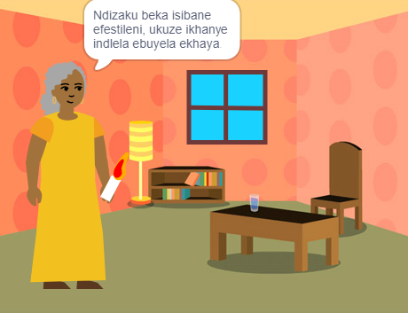

## Uzakwena

Yenza incwadi ethi 📚 kuScratch ngokusekelwe kwingcinga namacebo yakho 💡.

Uzaku:

+ Yenzela umntu okhethekileyo kuwe incwadi edijithali
+ Khetha izakhono oza kuzisebenzisa ukwenza incwadi yakho
+ Yabelana ngedilesi yewebhu yencwadi yakho

--- no-print ---

--- task ---

### Dlala ▶️ 

Cofa ekomemi ukuze utyhile iphepha.

Khangela ii-sprites eziziflihlayo ziziveze kumaphepha ahlukeneyo.
  
Kwenzeka ntoni xa ucofa kwi-sprite ngasinye?

  
**iZim ilinyumbazayo**: [Jonga ngaphakathi](https://scratch.mit.edu/projects/500189097/editor){:target="_blank"}

  <iframe allowtransparency="true" width="485" height="402" src="https://scratch.mit.edu/projects/embed/500189097/?autostart=false" frameborder="0"></iframe>

--- /task ---

--- /no-print ---

Incwadi yakho kuya kufuneka ihlangabezane  **Isishwankathelo socwangciso lweprojekthi***.

I- **Isishwankathelo socwangciso lweprojekthi** lucacisa oko kufuneka kwenziwe yiprojekthi. Kufana nje nokunikwa umsebenzi ekufuneka uwugqibe.

### 🎯ISISHWANKATHELO SOCWANCISO LWEPROJEKTHI: Yenza **incwadi yedijithali**

Kuya kufuneka ukhethe ukuba oluphi uhlobo lwencwadi kwaye uyenzela bani. 

Incwadi yakho kufuneka:
+ 📃 Ibe namaphepha amaninzi, ngendlela yotyhila uye kwiphepha elilandelayo
+ 🐢 Ibe ne-sprite esinye ubuncinane
+ 💬 Ithethe okanye yenze into eyahlukileyo kwiphepha ngalinye

Incwadi yakho inokuba:
+ 🔉 Ibe neziphumo zentetho okanye zesandi 
+ 🎨 Ibe nemihlathi okanye ubugcisa obudalwe kwihlelo wepeyinti
+ 🖱️ Ibe nentsebenziswano nomfundi wencwadi kwiphepha ngalinye

--- no-print ---

### Fumana izimvo 💭

--- task ---

Dlala ngale mizekelo ukuze ufumana amacebo eyakho incwadi:

⭐ Yabelana ngeprojekthi yakho egqityiweyo 'Ndikwenzele Incwadi'  ukuze ube nethuba lokuba iboniswe apha.

**Iqela lam lomculo** 🎸 : [Jonga ngaphakathi](https://scratch.mit.edu/projects/724148783/editor){:target="_blank"}

  <iframe allowtransparency="true" width="485" height="402" src="https://scratch.mit.edu/projects/embed/724148783/?autostart=false" frameborder="0"></iframe>

**⭐ UCinderella Nesigcawu** 🕷️ : [Jonga ngaphakathi](https://scratch.mit.edu/projects/799448516/editor){:target="_blank"}

  <iframe allowtransparency="true" width="485" height="402" src="https://scratch.mit.edu/projects/embed/799448516/?autostart=false" frameborder="0"></iframe>

**⭐ Ukutzibina selendikwenye indawo** 🚀 : [Jonga ngaphakathi](https://scratch.mit.edu/projects/793833913/editor){:target="_blank"} (iprojekthi ebonisiweyo eluntunwni)

  <iframe allowtransparency="true" width="485" height="402" src="https://scratch.mit.edu/projects/embed/793833913/?autostart=false" frameborder="0"></iframe>

**⭐ Uhlobo ubusika bufike ngayo** ☃️ : [Jonga ngaphakathi](https://scratch.mit.edu/projects/707648744/editor){:target="_blank"} (iprojekthi yoluntu evelele)

  <iframe allowtransparency="true" width="485" height="402" src="https://scratch.mit.edu/projects/embed/707648744/?autostart=false" frameborder="0"></iframe>

--- /task ---

--- /no-print ---

--- print-only ---

### Fumana izimvo

Ukuze ufumane amacebo ngencwadi📚 yakho, **Jonga ngaphakathi** imizekelo yeeprojekthi kwi-'I made you a book — Umzekelo we-' Scratch studio: https://scratch.mit.edu/studios/29082370

--- /print-only ---

