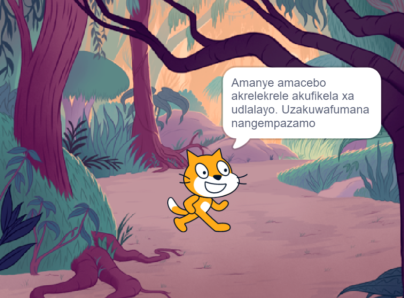

## Cwangcisa incwadi yakho 📔

Sebenzisa eli nyathelo ukucwangcisa incwadi yakho. Ungacwangcisa ngokucinga nje, wongeze iimvelaphi kunye nezi-sprite kwuScratch, okanye uzobe okanye ubhale — okanye nangayiphi na indlela othanda ngayo!

Ngoku, lixesha lokuba uqale ukucinga ngamaphepha (iimvelaphi) kunye nabalinganiswa kunye nezinto (iziprite) kwincwadi yakho.

--- task ---

Vula i- [Ndikwenzele iprojekthi yokuqalisa iincwadi](https://scratch.mit.edu/studios/29082370){:target="_blank"}. U-Scratch uya kuvula kwenye ithebhu yesikhangeli.

Akukho xesha elininzi? Ungaqala ngomnye we- [imizekelo](https://scratch.mit.edu/studios/29082370){:target="_blank"}.

--- collapse ---
---
title: Ukusebenza ngaphandle kweintanethi
---

Ngolwazi malunga nendlela yokuseta uScratch ukuze asebenze ngaphandle kwe intanethi, ndwendwela isikhokeli sethu u-['Ukuqala ngo Scratch'](https://projects.raspberrypi.org/xh-ZA/projects/getting-started-scratch){:target="_blank"}.

--- /collapse ---

--- /task ---

--- task ---

Sebenzisa iprojekthi yakho entsha kaScratch ukucwangcisa incwadi yakho. Akunyanzelekanga ukuba ucwangcise onke amaphepha unokuwafaka kamva.

Ungasebenzisa kwakhona ipensile ✏️ kunye ne- [eli phepha lokucwangcisa](resources/i-made-a-book-worksheet.pdf){:target="_blank"} okanye iphepha elingenanto ukuze uzobe izimvo zakho.

Cinga ngemvelaphi kunye nezi-sprite:
- 🖼️ Yeyiphi imibala yemvelaphi oza kuyisebenzisa kwincwadi yakho?
- 🗒️ Abasebenzisi baza kusebenzisana njani nencwadi yakho ukuze batyhile kwiphepha elilandelayo?
- 🦁 Ngabaphi abalinganiswa kunye nezinto oza kuba nazo encwadini yakho?
- 🏃‍♀️ Izisprite ziza kuboniswa njani kwaye zinxibelelane njani kwiphepha ngalinye?

{:width="300px"}

--- /task ---
