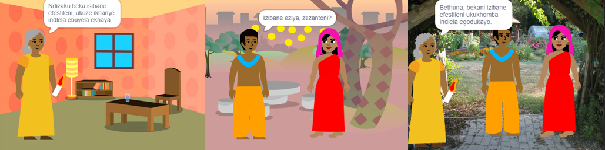

## Yakha kwaye uvavanye 🔄

Ngoku, lixesha lokwakha incwadi yakho. Qala kancinci, uze wongeze ngakumbi kwiprojekthi yakho ukuba unexesha.



**Icebiso:** Khumbula ukuvavanya iprojekthi yakho ngalo lonke ixesha usongeza into. Kulula kakhulu ukufumana nokulungisa iimpazamo ngaphambi kokuba wenze utshintsho oluninzi.

### Kwiphepha ngalinye 📃

--- task ---

Yongeza imvelaphi kunye neesprites ezintsha ozidingayo kweli phepha.


Kuzofuneka wongeze ikhowudi ukuze usete iindawo kunye nokubonakala kwe-sprites kwiphepha lokuqala lesihloko kunye nephepha ngalinye emva koko.

```blocks3
when flag clicked

when backdrop switches to [page v]
```

[[[scratch3-show-hide-sprites-backdrops]]]

[[[scratch3-positioning-with-layers]]]

--- /task ---

### Kwi-sprite nganye 🐈 🐢 🎈

--- task ---

Kuzofuneka wongeze ikhowudi kumlinganiswa ngamnye kunye ne-object sprite kwincwadi yakho. Cinga ukuba baza kwenza nantoni na xa iprojekthi iqala, xa imvelaphi itshintshela kwiphepha elithile okanye xa i-sprite sicofiwe.

```blocks3
when flag clicked

when this sprite clicked

when backdrop switches to [page v]
```

[[[scratch3-change-costumes-to-show-mood]]]

[[[scratch3-animate-movement-costumes]]]

[[[scratch3-graphic-effects]]]

[[[scratch3-jiggle-a-sprite]]]

--- /task ---

### Ukutyhila iphepha 📖

--- task ---

Uzodinga indlela yokuba umfundi wakho adlulele kwiphepha elilandelayo kwincwadi yakho.

```blocks3
when this sprite clicked
```

[[[scratch3-changing-backdrops-pages-levels]]]

--- /task ---

### Hlela iimpahla 🦁 kunye nemvelaphi 🖼️

--- task ---

Usenokufuna ukuhlela okanye ukongeza iimpahla okanye iimvelaphi kumhleli we peyinti.

{:width="250px"}


[[[scratch3-paint-a-new-backdrop-extended]]]

[[[scratch3-backdrops-and-sprites-using-shapes]]]

[[[scratch3-use-text-tool]]]

[[[scratch3-copy-parts-between-sprite-costumes]]]

[[[scratch3-add-costumes-to-a-sprite]]]

--- /task ---

### Yongeza isandi 🎵

--- task ---


```blocks3
when flag clicked

when this sprite clicked

when backdrop switches to [page v]
```


[[[scratch3-add-sound]]]


[[[scratch3-record-sound]]]


[[[scratch3-text-to-speech]]]

--- /task ---

### Izikhumbuzo zomhleli ku Scratch

[[[scratch3-copy-code]]]

[[[scratch3-full-screen]]]

[[[scratch3-duplicate-sprite]]]

--- task ---

**Uvavanyo:** 🔄 Bonisa omnye umntu iprojekthi yakho uze ucele 🗣️ impendulo yakhe. Ingaba ufuna ukwenza naluphi na utshintsho kwincwadi yakho?

⏱️ Ukuba unexesha, unokuphucula iprojekthi yakho.

💡 Unga:
- Yongeza ngakumbi ikhowudi kwi-sprites zakho
- Yongeza esinye i-sprite
- Yongeza elinye iphepha
- Rekhoda isandi
- Yenza isinxibo esitsha kumhleli we peyinti

--- /task ---

--- task ---

**Ukulungisa impazamo:** 🐞 Usenofumana iimpazamo kwiprojekthi yakho ekufuneke uzilungise. Nazi ezinye iimpazamo eziqhelekileyo:

--- collapse ---
---
title: I-sprite sivela okanye sifihlakele kumaphepha angalunganga
---

Jonga ukuba i-sprite sine `xa imvelaphi itshintshela kwi-`{:class="block3events"} scripts ezine <0>bonisa</0>{:class="block3looks"} okanye <0>fihla</0>{:class="block3looks"} iibhloko njengoko kudingeka. Qinisekisa ukuba ukhethe igama elilio lemvelaphi kwi- `xa imvelaphi itshintshela kwi-`{:class="block3events"} bhloko. Kuyanceda ukunika ii-emvelaphi amagama ozokuwaqonda ngokulula, ukunceda ekufumaneni iingxaki ezinje.

--- /collapse ---

--- collapse ---
---
title: I-sprite sijonge emazantsi amantla angaphezulu
---

Yongeza ibhloko ye `seta isitayile sokujikeleza ukusuka ekhohlo ukuya ekunene`{:class="block3motion"} okanye `seta isitayile sokujikeleza ungajikelezi`{:class="block3motion"}.

--- /collapse ---

--- collapse ---
---
title: I-sprite 'siyatsiba' xa sitshintsha isinxibo okanye sigxume
---

Qinisekisa ukuba isinxibo sibekwe embindini kumhleli we Peyinti (bhala umnqamlezo oluhlaza okwesibhakabhaka kwisinxibo kunye nomgca onqamlezileyo embindini womhleli wePaint).

--- /collapse ---

--- collapse ---
---
title: Isandi asidlali
---

Ngaba wongeze ibhloko `dlala isandi`{:class="block3sound"} xa kufuneka? Ukuba ukope ikhowudi kwesinye i-sprite, kuzofuneka wongeze isandi kwesi sprite kwithebhu ethi **iZandi**. Jonga ivolumu kwikhompyutha okanye kwithebhulethi yakho, uqinisekise ukuba awuyithobanga ivolumu ngekhowudi — zama `setha ivolumu ibe yi`{:class="block3sound"} `100`.

--- /collapse ---

--- collapse ---
---
title: Ezinye iziprite zimana zisiya phambi kwe-sprite
---

Yongeza ibhloko ethi `ukuya kumaleko angaphambili`{:class="block3looks"}.

--- /collapse ---

--- collapse ---
---
title: I-sprite sishukuma okanye sitshintshe kube kanye kuphela
---

Faka ikhowudi yakho ngaphakathi kwibhloko e- `ngonaphakade`{:class="block3control"} ukuze iqhubeke isebenza.

--- /collapse ---

--- collapse ---
---
title: Amaphepha alandelelana ngendlela engeyiyo
---

Jonga ukuba imvelaphi yakho ilandelelana kanjani na: cofa kwi payini yeQonga uze ucofe kwithebhu ethi **Iimvelaphi** ukuze ubone iimvelaphi zeprojekthi yakho.

--- /collapse ---

Usenofumana impazamo engadweliswanga apha. Ingaba ungajonga indlela yokuyilungisa?

🗣️ Siyakuthanda ukuva ngeempazamo zakho kunye nendlela ozilungise ngayo. Sebenzisa iqosha loku **Thumela impendulo** elisezantsi kweli phepha kwaye usixelele ukuba ufumene impazamo eyahlukileyo na kwiprojekthi yakho.

--- /task ---

